# AI English Tutor API - Technical Documentation

## Table of Contents
1. [System Overview](#system-overview)
2. [Architecture](#architecture)
3. [Key Components](#key-components)
4. [Database Design](#database-design)
5. [API Endpoints](#api-endpoints)
6. [WebSocket Flows](#websocket-flows)
7. [Sequence Diagrams](#sequence-diagrams)
8. [Security & Authentication](#security--authentication)
9. [External Integrations](#external-integrations)
10. [Deployment](#deployment)

## System Overview

The AI English Tutor API is a comprehensive FastAPI-based backend system designed to provide personalized English learning experiences for Urdu-speaking learners. The system features real-time conversation practice, progress tracking, messaging capabilities, and multi-stage learning exercises.

### Key Features
- **Multi-Stage Learning System**: 6 stages from A1 Beginner to C2 Mastery
- **Real-time Conversation Practice**: WebSocket-based voice interactions
- **Progress Tracking**: Comprehensive analytics and achievement system
- **Messaging System**: Real-time chat with WebSocket support
- **AI-Powered Feedback**: GPT-4 based evaluation and correction
- **Multi-modal Support**: Speech-to-Text, Text-to-Speech, Translation
- **Authentication & Authorization**: JWT-based with role management

## Architecture

### High-Level Architecture

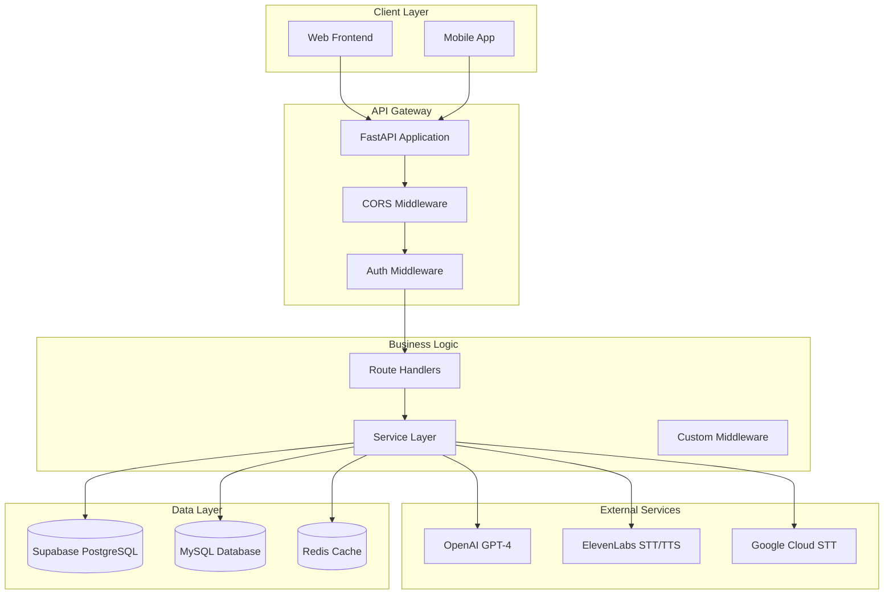

### Component Architecture

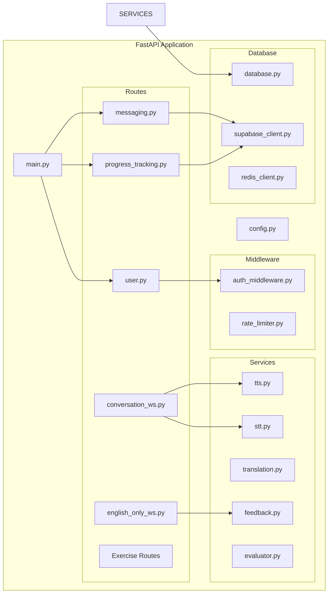

## Key Components

### 1. Main Application (`main.py`)
- **Purpose**: Application entry point and router configuration
- **Features**: 
  - FastAPI app initialization with comprehensive metadata
  - CORS configuration for cross-origin requests
  - Route inclusion with organized tagging system
  - Startup/shutdown event handlers
  - Health check endpoints

### 2. Authentication System (`auth_middleware.py`)
- **Purpose**: JWT-based authentication and authorization
- **Features**:
  - Supabase JWT token validation
  - Role-based access control (admin, teacher, student)
  - User session management
  - Protected route decorators

### 3. Progress Tracking System (`supabase_client.py`)
- **Purpose**: Comprehensive learning progress management
- **Features**:
  - User progress initialization
  - Topic attempt recording
  - Exercise and stage completion tracking
  - Achievement system
  - Streak calculation
  - Content unlocking logic

### 4. Messaging System (`routes/messaging.py`)
- **Purpose**: Real-time messaging and conversation management
- **Features**:
  - Conversation CRUD operations
  - Real-time message delivery via WebSocket
  - Message status tracking (sent, delivered, read)
  - Participant management
  - File upload support
  - Typing indicators

### 5. AI Services
#### Speech-to-Text (`services/stt.py`)
- **ElevenLabs STT**: Primary STT service with language detection
- **Google Cloud STT**: Fallback STT service
- **Features**: Multi-language support, audio format conversion, noise filtering

#### Text-to-Speech (`services/tts.py`)
- **ElevenLabs TTS**: High-quality voice synthesis
- **Features**: Multiple voice settings, speed control, audio caching

#### Translation (`services/translation.py`)
- **OpenAI GPT-4**: Urdu ↔ English translation
- **Features**: Context-aware translation, grammar correction

#### Feedback System (`services/feedback.py`)
- **OpenAI GPT-4**: AI-powered conversation analysis
- **Features**: Multi-stage conversation management, error correction, learning path adaptation

## Database Design

### Primary Databases

#### 1. Supabase PostgreSQL (Progress & Messaging)
```sql
-- User Progress Tables
ai_tutor_user_progress_summary
ai_tutor_user_stage_progress
ai_tutor_user_exercise_progress
ai_tutor_user_topic_progress
ai_tutor_daily_learning_analytics
ai_tutor_learning_unlocks

-- Messaging Tables
conversations
messages
conversation_participants
message_status
user_status
profiles
```

#### 2. MySQL (WordPress Integration)
```sql
-- WordPress Tables
wp_users
wp_usermeta
```

#### 3. Redis (Caching)
- Session caching
- TTS audio caching
- Translation caching
- Rate limiting

### Data Models

#### Progress Tracking Schema
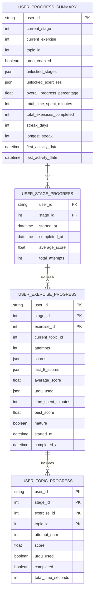

#### Messaging Schema
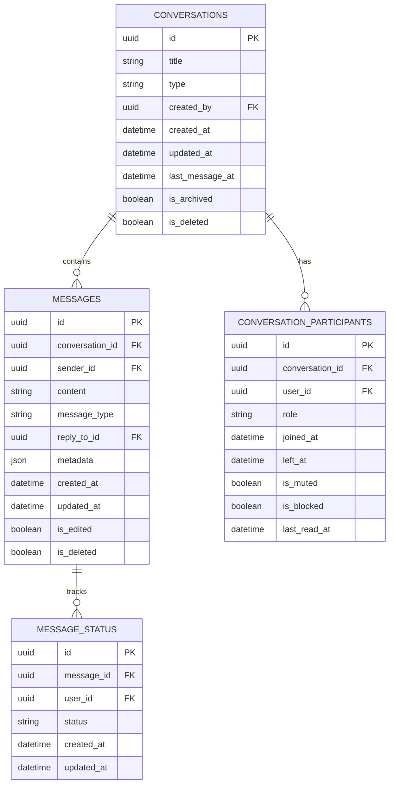

## API Endpoints

### Authentication Endpoints
```
POST /user/register                    # User registration with CEFR evaluation
POST /user/register-wordpress          # WordPress user creation
POST /user/login-wordpress             # WordPress user authentication
```

### Progress Tracking Endpoints
```
POST /api/progress/initialize-progress      # Initialize user progress
POST /api/progress/record-topic-attempt     # Record learning attempt
GET  /api/progress/user-progress/{user_id}  # Get user progress
POST /api/progress/check-unlocks/{user_id}  # Check content unlocks
POST /api/progress/get-current-topic        # Get current topic for exercise
POST /api/progress/comprehensive-progress   # Get detailed progress data
```

### Messaging Endpoints
```
# Conversations
POST   /api/conversations                    # Create conversation
GET    /api/conversations                    # List conversations (paginated)
GET    /api/conversations/{id}               # Get conversation details
PUT    /api/conversations/{id}               # Update conversation
DELETE /api/conversations/{id}               # Delete conversation

# Messages
POST   /api/conversations/{id}/messages      # Send message
GET    /api/conversations/{id}/messages      # Get messages (paginated)
PUT    /api/messages/{id}                    # Edit message
DELETE /api/messages/{id}                    # Delete message
POST   /api/messages/{id}/read               # Mark message as read
POST   /api/conversations/{id}/read          # Mark conversation as read

# Participants
POST   /api/conversations/{id}/participants  # Add participant
DELETE /api/conversations/{id}/participants/{user_id}  # Remove participant
PUT    /api/conversations/{id}/participants/{user_id}  # Update participant

# User Status
GET    /api/users/status                     # Get user statuses
PUT    /api/users/status                     # Update user status

# File Upload
POST   /api/conversations/{id}/upload        # Upload file to conversation
```

### Learning Exercise Endpoints
```
# Stage 1 - A1 Beginner
/api/repeat-after-me/*          # Exercise 1: Repeat After Me
/api/quick-response/*           # Exercise 2: Quick Response
/api/listen-and-reply/*         # Exercise 3: Listen and Reply

# Stage 2 - A2 Elementary  
/api/daily-routine/*            # Exercise 1: Daily Routine
/api/quick-answer/*             # Exercise 2: Quick Answer
/api/roleplay-simulation/*      # Exercise 3: Roleplay Simulation

# Stage 3 - B1 Intermediate
/api/storytelling/*             # Exercise 1: Storytelling
/api/group-dialogue/*           # Exercise 2: Group Dialogue
/api/problem-solving/*          # Exercise 3: Problem-Solving

# Stage 4 - B2 Upper Intermediate
/api/abstract-topic/*           # Exercise 1: Abstract Topic
/api/mock-interview/*           # Exercise 2: Mock Interview
/api/news-summary/*             # Exercise 3: News Summary

# Stage 5 - C1 Advanced
/api/critical-thinking/*        # Exercise 1: Critical Thinking
/api/academic-presentation/*    # Exercise 2: Academic Presentation
/api/in-depth-interview/*       # Exercise 3: In-Depth Interview

# Stage 6 - C2 Mastery
/api/spontaneous-speech/*       # Exercise 1: Spontaneous Speech
/api/sensitive-scenario/*       # Exercise 2: Sensitive Scenario
/api/critical-opinion-builder/* # Exercise 3: Critical Opinion Builder
```

### WebSocket Endpoints
```
/api/ws/learn                   # Learning conversation WebSocket
/api/ws/english-only           # English-only AI tutor WebSocket
/api/ws/{token}                # Messaging WebSocket with authentication
```

## WebSocket Flows

### 1. Learning Conversation WebSocket (`/api/ws/learn`)

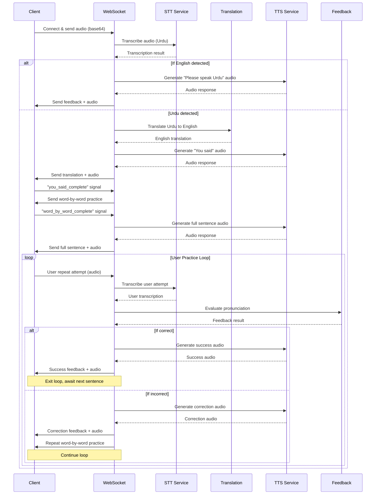

### 2. English-Only AI Tutor WebSocket (`/api/ws/english-only`)

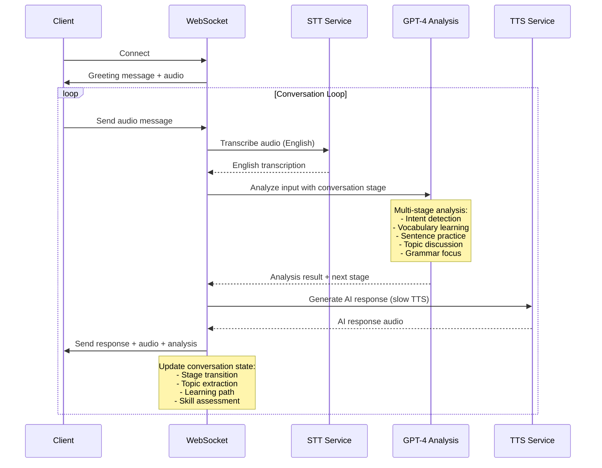

### 3. Messaging WebSocket (`/api/ws/{token}`)

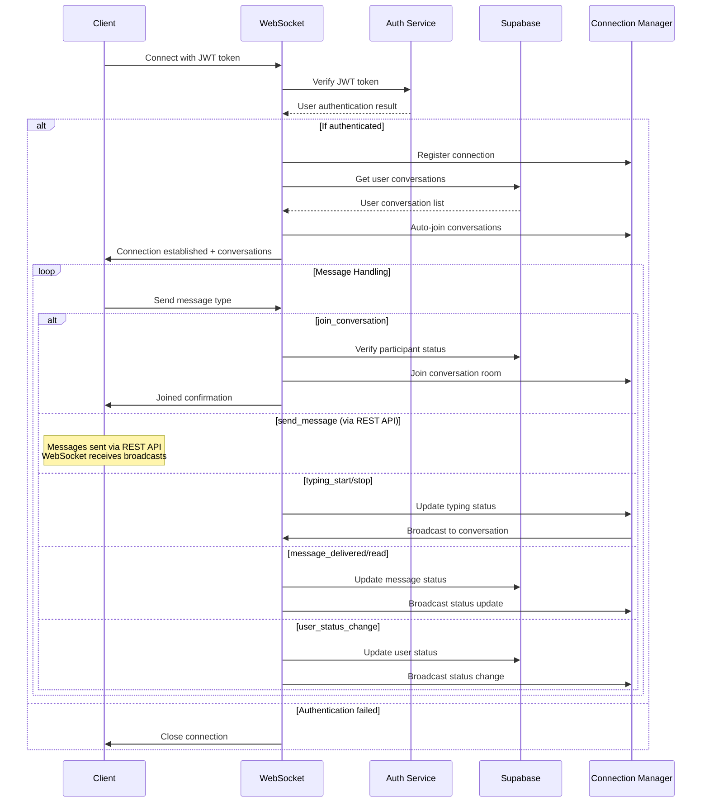

## Sequence Diagrams

### 1. User Registration & Progress Initialization

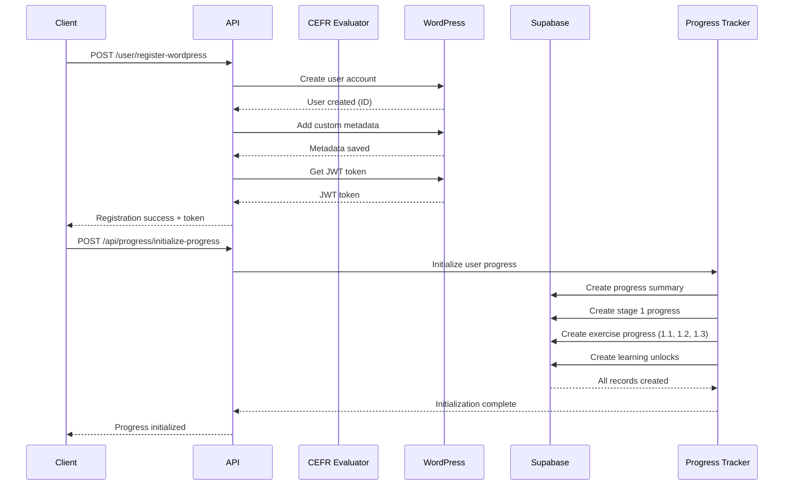

### 2. Learning Session Flow

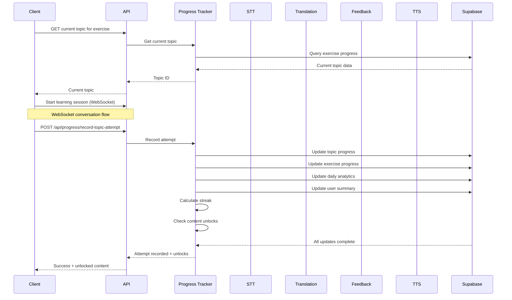

### 3. Real-time Messaging Flow

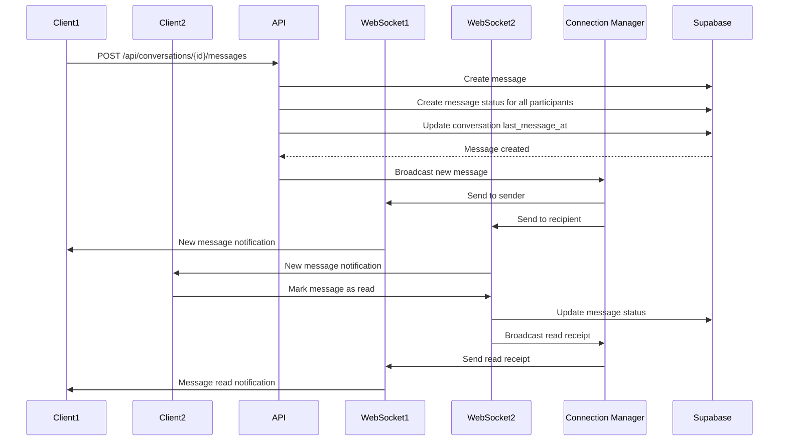

### 4. Progress Analytics & Achievement Flow

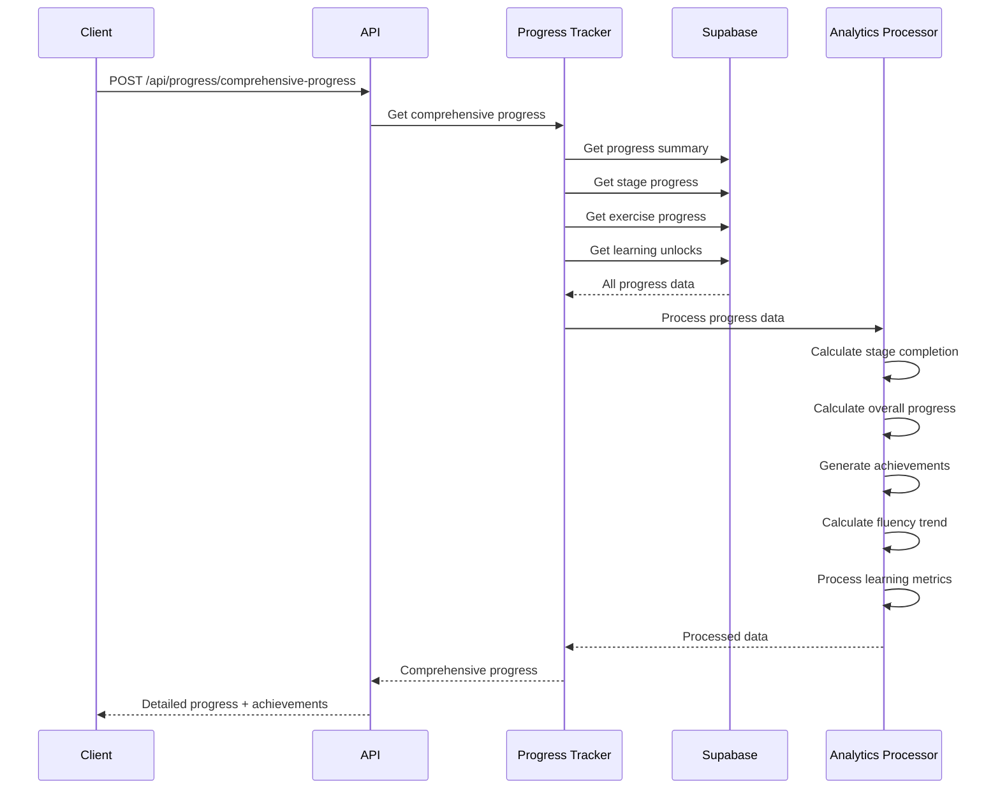

## Security & Authentication

### JWT Authentication Flow

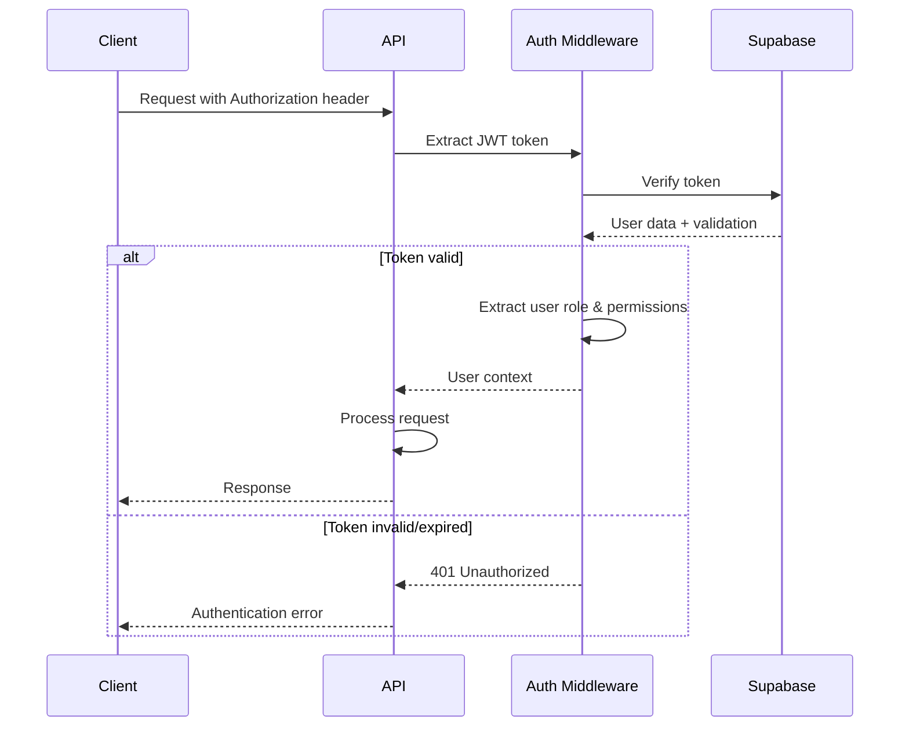

### Role-Based Access Control

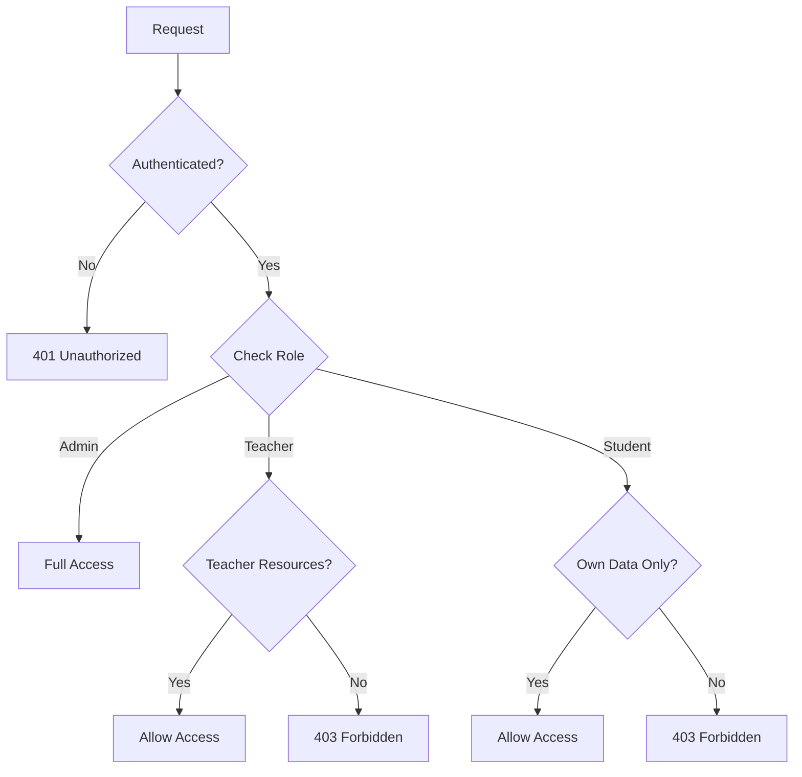

### Security Features
- **JWT Token Validation**: Supabase-based token verification
- **Role-Based Authorization**: Admin, Teacher, Student roles
- **Data Isolation**: Users can only access their own progress data
- **Rate Limiting**: Redis-based rate limiting middleware
- **CORS Configuration**: Controlled cross-origin access
- **Input Validation**: Pydantic schema validation
- **SQL Injection Protection**: ORM-based database queries

## External Integrations

### 1. OpenAI GPT-4
- **Purpose**: AI conversation analysis, translation, feedback generation
- **Endpoints**: Chat Completions API
- **Models**: GPT-4 Turbo
- **Usage**: 
  - Urdu ↔ English translation
  - Conversation analysis and feedback
  - Learning path recommendations
  - Error correction and suggestions

### 2. ElevenLabs
- **Purpose**: High-quality speech synthesis and recognition
- **Services**:
  - **Text-to-Speech**: Voice synthesis with emotion control
  - **Speech-to-Text**: Multi-language transcription with noise filtering
- **Features**:
  - Multiple voice settings (stability, similarity, speed)
  - Language detection
  - Audio format conversion
  - Background noise removal

### 3. Google Cloud Speech-to-Text
- **Purpose**: Fallback STT service
- **Features**: Multi-language support, high accuracy
- **Usage**: Backup transcription service

### 4. Supabase
- **Purpose**: Primary database and authentication
- **Services**:
  - **PostgreSQL Database**: Progress tracking, messaging
  - **Authentication**: JWT token management
  - **Real-time**: WebSocket subscriptions (future use)
- **Tables**: 15+ tables for comprehensive data management

### 5. WordPress Integration
- **Purpose**: User management system
- **Features**:
  - User registration and authentication
  - Custom user metadata
  - JWT token generation
- **API**: WordPress REST API v2

### 6. Redis
- **Purpose**: Caching and session management
- **Usage**:
  - TTS audio caching
  - Translation result caching
  - Rate limiting counters
  - Session data storage

## Deployment

### Environment Configuration
```bash
# API Keys
OPENAI_API_KEY=sk-...
ELEVEN_API_KEY=...
ELEVEN_VOICE_ID=...

# Database Configuration
DB_USER=...
DB_PASSWORD=...
DB_HOST=...
DB_NAME=...

# Supabase Configuration
SUPABASE_URL=https://...
SUPABASE_SERVICE_KEY=...

# WordPress Integration
WP_SITE_URL=https://...
WP_API_USERNAME=...
WP_API_APPLICATION_PASSWORD=...

# Redis Configuration
REDIS_HOST=localhost
REDIS_PORT=6379

# Application Configuration
ENVIRONMENT=production
```

### Docker Deployment

```yaml
# docker-compose.yml
version: '3.8'
services:
  api:
    build: .
    ports:
      - "8000:8000"
    environment:
      - ENVIRONMENT=production
    depends_on:
      - redis
      - mysql
    
  redis:
    image: redis:alpine
    ports:
      - "6379:6379"
    
  mysql:
    image: mysql:8.0
    environment:
      MYSQL_ROOT_PASSWORD: ${DB_PASSWORD}
      MYSQL_DATABASE: ${DB_NAME}
    ports:
      - "3306:3306"
```

### Production Considerations

1. **Scalability**:
   - Horizontal scaling with load balancer
   - Redis cluster for caching
   - Database read replicas

2. **Monitoring**:
   - Application performance monitoring
   - Error tracking and logging
   - Health check endpoints

3. **Security**:
   - HTTPS/TLS encryption
   - Environment variable management
   - Regular security updates

4. **Backup & Recovery**:
   - Database backup strategies
   - Redis persistence configuration
   - Disaster recovery procedures

## Performance Optimizations

### 1. Caching Strategy
- **TTS Audio Caching**: Frequently used audio responses cached in Redis
- **Translation Caching**: Common translations cached with LRU eviction
- **Database Query Optimization**: Indexed queries and connection pooling

### 2. Asynchronous Processing
- **Thread Pool Execution**: CPU-intensive tasks (STT, TTS) run in thread pools
- **Parallel Processing**: Multiple AI service calls executed concurrently
- **WebSocket Optimization**: Non-blocking message handling

### 3. Resource Management
- **Connection Pooling**: HTTP client reuse for external API calls
- **Memory Management**: Limited cache sizes with automatic cleanup
- **Rate Limiting**: Prevents API abuse and ensures fair usage

### 4. Audio Processing Optimization
- **Format Conversion**: Optimized audio format handling with pydub
- **Streaming**: Large audio files processed in chunks
- **Compression**: Audio data compressed for network transmission

## API Rate Limits

| Endpoint Category | Rate Limit | Window |
|------------------|------------|---------|
| Authentication | 10 requests | 1 minute |
| Progress Tracking | 100 requests | 1 hour |
| Messaging | 1000 requests | 1 hour |
| WebSocket Connections | 5 connections | 1 minute |
| File Upload | 20 uploads | 1 hour |

## Error Handling

### HTTP Status Codes
- **200**: Success
- **201**: Created
- **204**: No Content
- **400**: Bad Request (validation errors)
- **401**: Unauthorized (authentication required)
- **403**: Forbidden (insufficient permissions)
- **404**: Not Found
- **429**: Too Many Requests (rate limited)
- **500**: Internal Server Error

### Error Response Format
```json
{
  "error": "ValidationError",
  "message": "Invalid input data",
  "details": {
    "field": "email",
    "issue": "Invalid email format"
  },
  "timestamp": "2024-01-20T10:00:00Z"
}
```

## Future Enhancements

1. **Advanced Analytics**: Machine learning-based learning path optimization
2. **Mobile SDK**: Native mobile app integration
3. **Offline Support**: Cached content for offline learning
4. **Gamification**: Enhanced achievement and reward systems
5. **Social Features**: Peer learning and collaboration tools
6. **Multi-language Support**: Additional language pairs beyond Urdu-English
7. **Voice Cloning**: Personalized TTS voices for learners
8. **Real-time Collaboration**: Shared learning sessions and group exercises

---

*This documentation provides a comprehensive overview of the AI English Tutor API system. For specific implementation details, refer to the source code and inline documentation.*
