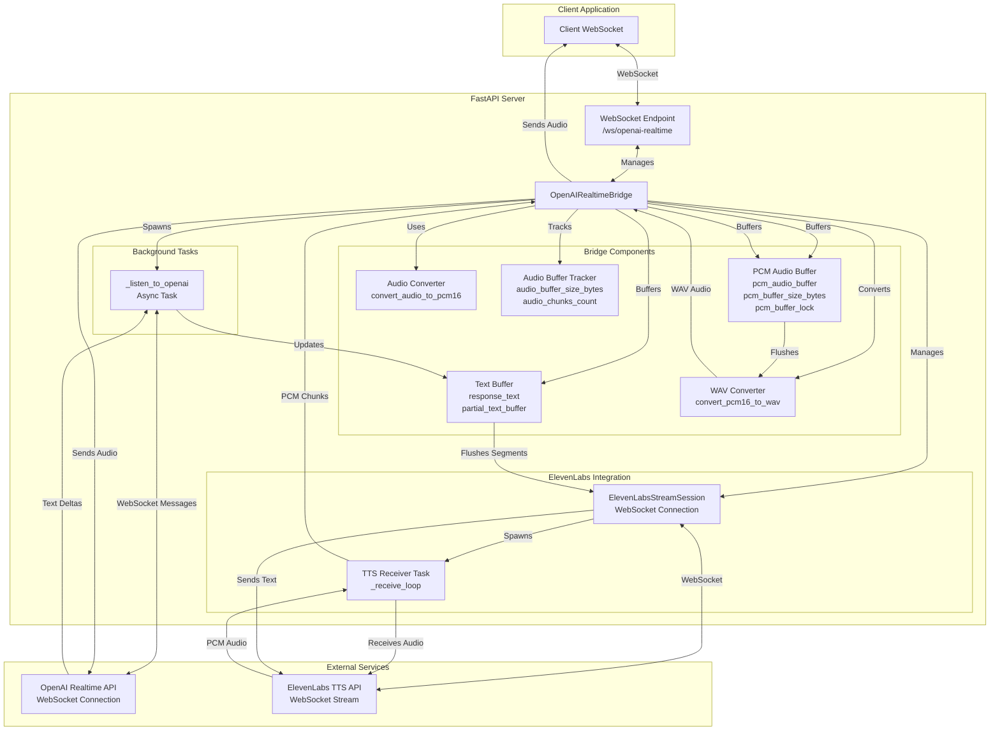
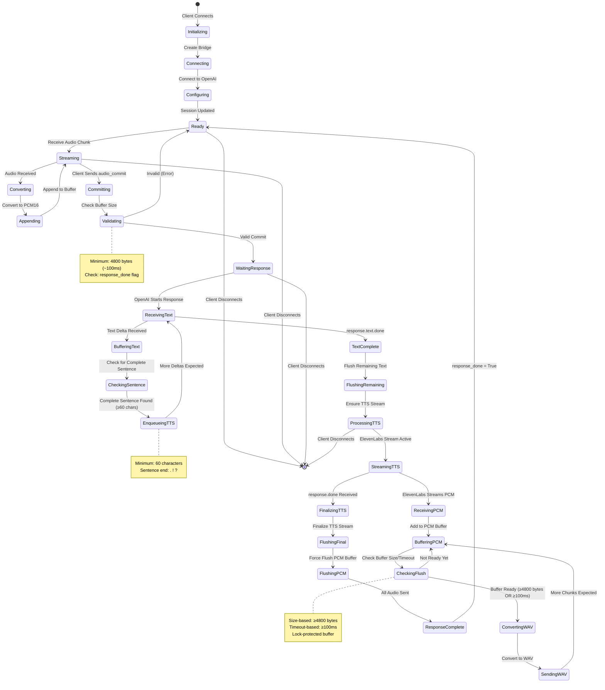
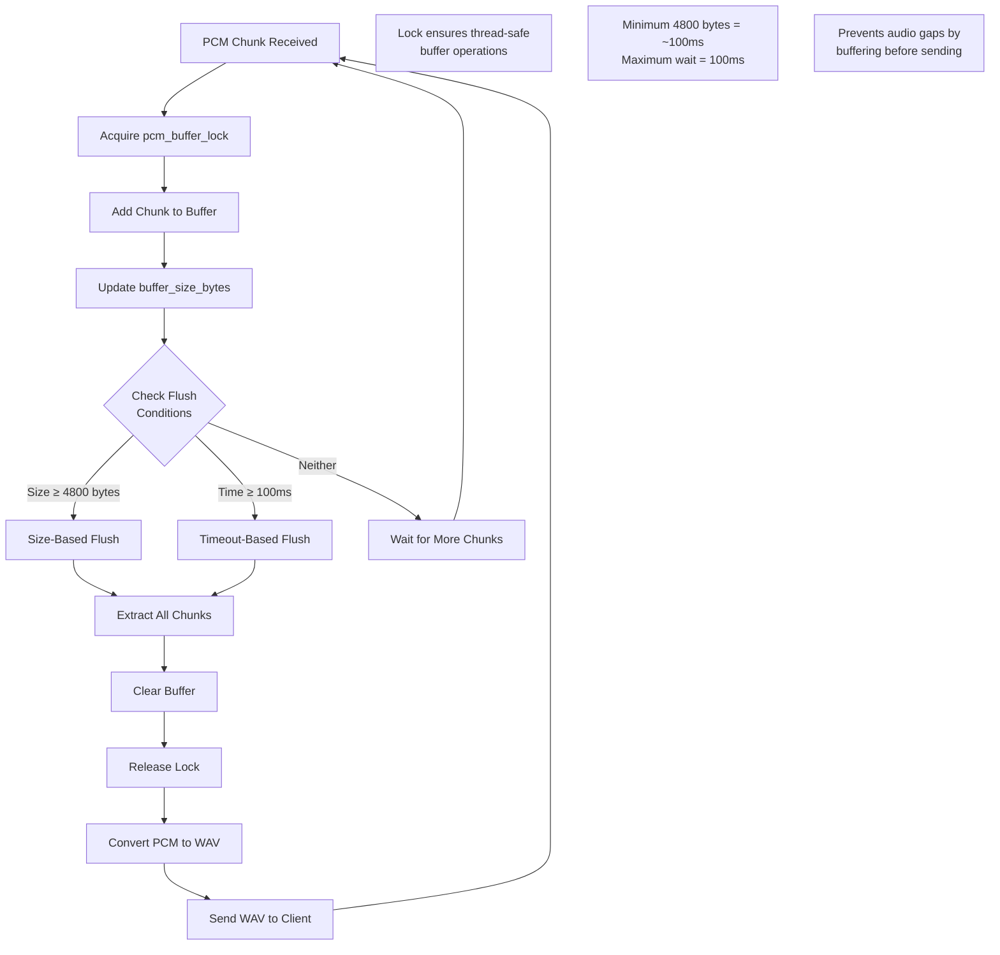

# OpenAI Realtime WebSocket Workflow Diagram (Updated Version)

## Complete System Workflow with ElevenLabs WebSocket Streaming

```mermaid
sequenceDiagram
    participant Client
    participant WS_Endpoint as WebSocket Endpoint<br/>(/ws/openai-realtime)
    participant Bridge as OpenAIRealtimeBridge
    participant OpenAI as OpenAI Realtime API
    participant ElevenLabs as ElevenLabs TTS<br/>(WebSocket Stream)
    participant PCM_Buffer as PCM Audio Buffer

    Note over Client,PCM_Buffer: === INITIALIZATION PHASE ===
    
    Client->>WS_Endpoint: WebSocket Connect
    WS_Endpoint->>WS_Endpoint: Accept Connection
    WS_Endpoint->>Bridge: Initialize Bridge(client_ws)
    Bridge->>Bridge: Initialize State Variables<br/>(buffers, locks, flags)
    
    Bridge->>OpenAI: Connect WebSocket<br/>(wss://api.openai.com/v1/realtime)
    OpenAI-->>Bridge: Connection Established
    
    Bridge->>OpenAI: Send session.update<br/>(modalities: audio/text,<br/>turn_detection: None,<br/>instructions: SYSTEM_PROMPT)
    OpenAI-->>Bridge: session.created
    OpenAI-->>Bridge: session.updated
    Bridge->>Bridge: Set session_ready = True
    
    Bridge->>Bridge: Start _listen_to_openai() task<br/>(Background async task)
    
    WS_Endpoint->>Client: Send {"type": "connected"}

    Note over Client,PCM_Buffer: === AUDIO STREAMING PHASE ===
    
    loop For Each Audio Chunk from Client
        Client->>WS_Endpoint: Send Binary Audio Data
        WS_Endpoint->>Bridge: send_audio_to_openai(audio_bytes)
        
        alt Session Not Ready
            Bridge->>Bridge: Wait up to 5s for session_ready
        end
        
        Bridge->>Bridge: convert_audio_to_pcm16()<br/>(Convert to 24kHz, mono, 16-bit PCM)
        Bridge->>Bridge: Base64 Encode PCM16 Audio
        Bridge->>OpenAI: input_audio_buffer.append<br/>(audio: base64_encoded)
        
        OpenAI-->>Bridge: (No error response)
        Bridge->>Bridge: Wait 0.08s, check for errors
        Bridge->>Bridge: Track buffer_size_bytes<br/>Track audio_chunks_count
    end

    Note over Client,PCM_Buffer: === COMMIT & RESPONSE PHASE ===
    
    Client->>WS_Endpoint: Send {"type": "audio_commit"}
    WS_Endpoint->>Bridge: commit_audio_and_get_response()
    
    alt Response Already In Progress
        Bridge->>Client: Send Error: "response_in_progress"
    else Insufficient Audio (< 4800 bytes)
        Bridge->>Client: Send Error: "insufficient_audio"
    else Valid Commit
        Bridge->>Bridge: Reset response state<br/>(response_done = False,<br/>clear text buffers)
        Bridge->>Bridge: Clear PCM buffer<br/>(prevent mixing audio)
        Bridge->>Bridge: Abort any existing TTS stream
        
        Bridge->>OpenAI: input_audio_buffer.commit
        OpenAI-->>Bridge: input_audio_buffer.commit (confirmation)
        
        Bridge->>Bridge: Reset buffer tracking
        Bridge->>OpenAI: response.create<br/>(modalities: ["text"])
        
        Note over OpenAI: OpenAI processes audio<br/>and generates text response
        
        loop Text Delta Streaming
            OpenAI-->>Bridge: response.output_text.delta<br/>(or response.text.delta)
            Bridge->>Bridge: Append to response_text<br/>Append to partial_text_buffer
            Bridge->>Bridge: _try_flush_partial_segment()<br/>(Check for complete sentences ≥60 chars)
            
            alt Complete Sentence Found
                Bridge->>Bridge: Extract sentence segment
                Bridge->>Bridge: _send_tts_text(segment)
                Bridge->>Bridge: _ensure_tts_stream()<br/>(Create ElevenLabs stream if needed)
                Bridge->>ElevenLabs: WebSocket Connect<br/>(if first time)
                Bridge->>ElevenLabs: Send initialization payload
                Bridge->>ElevenLabs: send_text(segment)
            end
            
            Bridge->>Client: Send {"type": "transcript_delta",<br/>"text": accumulated_text}
        end
        
        OpenAI-->>Bridge: response.output_text.done<br/>(or response.text.done)
        Bridge->>Bridge: Finalize response_text
        Bridge->>Client: Send {"type": "transcript_done",<br/>"text": final_text}
        Bridge->>Bridge: _try_flush_partial_segment(force=True)<br/>(Flush remaining buffer)
        
        OpenAI-->>Bridge: response.done
        Bridge->>Bridge: _finalize_tts_stream(force=True)
        
        Note over ElevenLabs,PCM_Buffer: === ELEVENLABS TTS PROCESSING ===
        
        loop ElevenLabs Audio Streaming
            ElevenLabs-->>Bridge: WebSocket Message<br/>(JSON with base64 audio)
            Bridge->>Bridge: Decode base64 audio to PCM
            Bridge->>Bridge: _handle_elevenlabs_audio_chunk(pcm_chunk)
            
            Bridge->>PCM_Buffer: Add chunk to buffer<br/>(with lock protection)
            PCM_Buffer->>Bridge: Check buffer size & timeout
            
            alt Buffer Ready to Flush<br/>(≥4800 bytes OR ≥100ms timeout)
                Bridge->>Bridge: Combine PCM chunks
                Bridge->>Bridge: convert_pcm16_to_wav()<br/>(Convert to WAV format)
                Bridge->>Client: Send Binary WAV Audio
                Bridge->>PCM_Buffer: Clear buffer<br/>Update last_flush_time
            end
        end
        
        Bridge->>ElevenLabs: finalize()<br/>(Send empty text to trigger final audio)
        Bridge->>Bridge: _flush_pcm_buffer(force=True)<br/>(Flush any remaining audio)
        Bridge->>Bridge: Set response_done = True
        Bridge->>Client: Send {"type": "response_done"}
    end

    Note over Client,PCM_Buffer: === ERROR HANDLING ===
    
    alt OpenAI Error
        OpenAI-->>Bridge: {"type": "error", "code": "...", "message": "..."}
        Bridge->>Bridge: Track error (if append-related)
        
        alt input_audio_buffer_commit_empty
            Bridge->>Bridge: Reset buffer tracking
        else conversation_already_has_active_response
            Bridge->>Bridge: Set response_done = False
        end
        
        Bridge->>Client: Send {"type": "error", "code": "...", "message": "..."}
        Bridge->>Bridge: _finalize_tts_stream(force=True)
    end
    
    alt ElevenLabs Error
        ElevenLabs-->>Bridge: {"error": {...}}
        Bridge->>Bridge: Mark stream as closed
        Bridge->>Bridge: Handle error gracefully
    end

    Note over Client,PCM_Buffer: === CLEANUP PHASE ===
    
    alt Client Disconnect or Close
        Client->>WS_Endpoint: WebSocket Disconnect<br/>(or {"type": "close"})
        WS_Endpoint->>Bridge: close()
        Bridge->>OpenAI: Close WebSocket
        Bridge->>ElevenLabs: abort() TTS Stream<br/>(Cancel receiver task, close WS)
        Bridge->>Bridge: Set is_connected = False
    end
```

## Component Architecture

## State Machine Diagram

## Data Flow Diagram

```mermaid
flowchart LR
    subgraph "Input Flow"
        A1[Client Audio<br/>Any Format] --> A2[convert_audio_to_pcm16]
        A2 --> A3[PCM16 Audio<br/>24kHz, mono, 16-bit]
        A3 --> A4[Base64 Encode]
        A4 --> A5[OpenAI Buffer]
    end
    
    subgraph "Processing Flow"
        B1[OpenAI Processes Audio] --> B2[Text Deltas]
        B2 --> B3[Accumulate Text]
        B3 --> B4{Complete<br/>Sentence?}
        B4 -->|Yes ≥60 chars| B5[Send to ElevenLabs]
        B4 -->|No| B3
        B5 --> B6[ElevenLabs WebSocket]
    end
    
    subgraph "Output Flow"
        C1[ElevenLabs WebSocket] --> C2[PCM Audio Chunks<br/>Base64 Encoded]
        C2 --> C3[Decode Base64]
        C3 --> C4[PCM Buffer<br/>Lock-Protected]
        C4 --> C5{Buffer Ready?<br/>Size OR Timeout}
        C5 -->|Yes| C6[Combine PCM Chunks]
        C5 -->|No| C4
        C6 --> C7[Convert to WAV<br/>24kHz, mono, 16-bit]
        C7 --> C8[Client Audio]
    end
    
    A5 --> B1
    B6 --> C1
```

## PCM Buffer Management Flow

## Key Workflow Steps Summary

1. **Initialization**: 
   - Client connects → Bridge created → OpenAI WebSocket established → Session configured → Background listener task started

2. **Audio Input**: 
   - Client sends audio chunks → Convert to PCM16 → Append to OpenAI buffer → Track buffer size

3. **Commit**: 
   - Client sends commit → Validate buffer (≥4800 bytes) → Clear PCM buffer → Abort any existing TTS stream → Commit to OpenAI → Request text-only response

4. **Text Streaming**: 
   - OpenAI streams text deltas → Accumulate text → Detect complete sentences (≥60 chars) → Send to ElevenLabs WebSocket stream → Send transcript deltas to client

5. **TTS Processing**: 
   - ElevenLabs WebSocket streams PCM audio chunks → Decode base64 → Buffer PCM chunks → Check flush conditions (size ≥4800 bytes OR timeout ≥100ms) → Convert to WAV → Send to client

6. **Completion**: 
   - Final transcript sent → Remaining text flushed → TTS stream finalized → Final PCM buffer flush → Response done flag set

7. **Cleanup**: 
   - Close OpenAI WebSocket → Abort ElevenLabs stream → Cancel receiver task → Reset state

## Key Features

- **PCM Buffering**: Reduces audio gaps by buffering PCM chunks before converting to WAV
- **Lock Protection**: Thread-safe buffer operations using asyncio.Lock
- **Dual Flush Strategy**: Size-based (≥4800 bytes) and timeout-based (≥100ms) flushing
- **ElevenLabs WebSocket**: Real-time streaming TTS using WebSocket instead of HTTP
- **Error Handling**: Comprehensive error tracking and recovery
- **State Management**: Proper state tracking to prevent race conditions

