# OpenAI Realtime WebSocket Workflow Diagram

## Complete System Workflow

## Component Architecture

## State Machine Diagram

```mermaid
stateDiagram-v2
    [*] --> Initializing: Client Connects
    
    Initializing --> Connecting: Create Bridge
    Connecting --> Configuring: Connect to OpenAI
    Configuring --> Ready: Session Updated
    
    Ready --> Streaming: Receive Audio Chunk
    Streaming --> Converting: Audio Received
    Converting --> Appending: Convert to PCM16
    Appending --> Streaming: Append to Buffer
    
    Streaming --> Committing: Client Sends audio_commit
    Committing --> Validating: Check Buffer Size
    Validating --> WaitingResponse: Valid Commit
    Validating --> Ready: Invalid (Error)
    
    WaitingResponse --> ReceivingText: OpenAI Starts Response
    ReceivingText --> BufferingText: Text Delta Received
    BufferingText --> EnqueueingTTS: Complete Sentence Found
    EnqueueingTTS --> ReceivingText: More Deltas Expected
    ReceivingText --> TextComplete: response.text.done
    
    TextComplete --> ProcessingTTS: Finalize Segments
    ProcessingTTS --> StreamingTTS: TTS Worker Processes Queue
    StreamingTTS --> SendingAudio: ElevenLabs Streams MP3
    SendingAudio --> ConvertingAudio: Buffer MP3 Chunks
    ConvertingAudio --> SendingWAV: Convert to WAV
    SendingWAV --> ProcessingTTS: More Segments?
    ProcessingTTS --> ResponseComplete: All Segments Done
    
    ResponseComplete --> Ready: response_done = True
    
    Ready --> [*]: Client Disconnects
    Streaming --> [*]: Client Disconnects
    WaitingResponse --> [*]: Client Disconnects
    ProcessingTTS --> [*]: Client Disconnects
    
    note right of Validating
        Minimum: 4800 bytes (~100ms)
        Check: response_done flag
    end note
    
    note right of EnqueueingTTS
        Minimum: 80 characters
        Sentence end: . ! ?
    end note
```

## Data Flow Diagram

## Key Workflow Steps Summary

1. **Initialization**: Client connects → Bridge created → OpenAI WebSocket established → Session configured → Background tasks started
2. **Audio Input**: Client sends audio chunks → Convert to PCM16 → Append to OpenAI buffer → Track buffer size
3. **Commit**: Client sends commit → Validate buffer → Commit to OpenAI → Request text-only response
4. **Text Streaming**: OpenAI streams text deltas → Accumulate text → Detect complete sentences → Enqueue to TTS
5. **TTS Processing**: Worker processes queue → Send to ElevenLabs → Stream MP3 → Convert to WAV → Send to client
6. **Completion**: Final transcript sent → All TTS segments processed → Response done flag set
7. **Cleanup**: Close connections → Cancel tasks → Reset state

